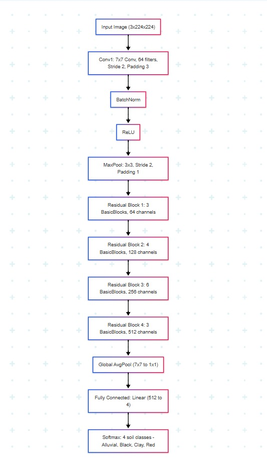
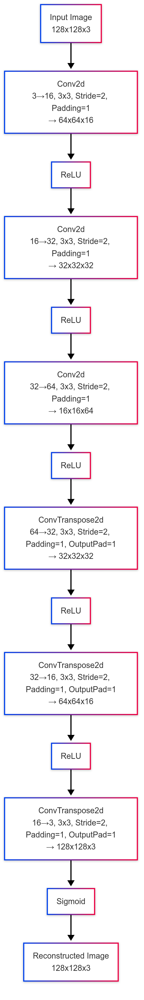

# 🌱 Soil Image Classification — ANNAM.AI Orientation Challenges

This repository contains two challenges from the **ANNAM.AI orientation Kaggle competition**:

- **Challenge 1:** Soil type classification using a fine-tuned ResNet34 model.
- **Challenge 2:** Anomaly detection in soil images using a convolutional autoencoder.

---

## 🧠 Architecture Overview

### 🔹 Challenge 1: ResNet34 Classifier

This model uses a **transfer learning approach** with **ResNet34**, fine-tuned for supervised soil classification. The workflow includes:

- Image preprocessing using `torchvision.transforms`
- Model training and evaluation
- CSV generation for Kaggle submission



---

### 🔹 Challenge 2: Autoencoder for Anomaly Detection

A **convolutional autoencoder** is trained using only normal soil images (`label = 1`). At inference time, reconstruction error is used to detect anomalies (`label = 0`).



---

## 📁 Folder Structure

```
.
├── challenge-1/
│   ├── docs/cards/
│   │   ├── architecure.png
│   │   ├── ml-metrics.json
│   │   └── project_card.ipynb
│   ├── notebook/
│   │   └── soil_classification_annam.ipynb
│   ├── submission.csv
│   └── transcript.txt
│
├── challenge-2/
│   ├── docs/cards/
│   │   ├── architecture-2.png
│   │   └── project_card_2.ipynb
│   ├── notebook/
│   │   └── binary-classification-02.ipynb
│
├── requirements.txt
└── README.md  ← (You're here)
```

---

## ⚙️ Setup Instructions

### 1. Clone the Repository

```bash
git clone <repo-url>
cd <repo-folder>
```

### 2. Create and Activate a Virtual Environment (Recommended)

```bash
python -m venv venv
source venv/bin/activate    # Windows: venv\Scripts\activate
```

### 3. Install Dependencies

```bash
pip install -r requirements.txt
```

---

## 🚀 Usage

### 🧪 Challenge 1 — ResNet34 Classifier

Navigate to the notebook and run:

```bash
jupyter notebook challenge-1/notebook/soil_classification_annam.ipynb
```

Steps include:
- Loading the soil classification dataset
- Preprocessing with data augmentation
- Fine-tuning ResNet34
- Evaluating model performance
- Generating Kaggle-formatted submission

---

### 🧪 Challenge 2 — Autoencoder Anomaly Detection

Run the notebook using:

```bash
jupyter notebook challenge-2/notebook/binary-classification-02.ipynb
```

Steps include:
- Training autoencoder on normal (label = 1) images
- Reconstructing and calculating MSE
- Flagging anomalies based on reconstruction error threshold
- Generating submission file (if needed)

---

## 📊 Evaluation Metrics

- **Challenge 1 (ResNet34):** Accuracy, F1 Score, Precision, Recall — stored in [`ml-metrics.json`](./challenge-1/docs/cards/ml-metrics.json)
- **Challenge 2 (Autoencoder):** MSE-based anomaly detection — analyzed in the notebook

---

## 📜 Notes

- The ResNet34 model leverages **transfer learning** for fast convergence and high accuracy.
- The autoencoder generalizes well and serves as a lightweight **unsupervised anomaly detector**.
- Both challenges are modular and easy to extend with new architectures or datasets.

---

