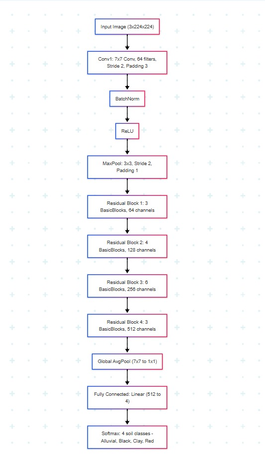

# Soil Type Classification using Deep Learning 🌱

This project was developed during the ANNAM.AI orientation Kaggle competition. It focuses on *classifying soil types* from image data using a deep learning model based on a fine-tuned ResNet34 architecture.

---

## 🧠 Architecture Overview

The model is built using a *transfer learning approach* with *ResNet34*, fine-tuned for soil classification. The pipeline involves:
- Image preprocessing using standard transforms.
- Training on labeled soil images.
- Evaluation and inference on test images.

---

## 📁 Folder Structure

.
├── docs/cards
│   ├── architecure.png            # Model architecture image
│   ├── ml-metrics.json            # Evaluation metrics
│   └── project_card.ipynb         # Project summary notebook
│
├── notebook
│   └── soil_classification_annam.ipynb  # Main training & inference notebook
│
├── README.md                      # Project documentation (you're reading it)
├── requirements.txt              # Dependencies
├── submission.csv                # Sample submission format
├── transcript.txt                # Summary/transcript of project insights

---

## ⚙️ Setup Instructions

### 1. Clone the repository

bash
git clone <repo-url>
cd <repo-folder>

### 2. Create and activate a virtual environment (optional but recommended)

bash
python -m venv venv
source venv/bin/activate    # On Windows: venv\Scripts\activate

### 3. Install dependencies

bash
pip install -r requirements.txt

---

## 🚀 Usage

### 🧪 Run the Notebook

Open the main notebook in Jupyter or Colab:

bash
jupyter notebook notebook/soil_classification_annam.ipynb

Follow the cells to:
- Load and preprocess data
- Train the model
- Evaluate results
- Generate predictions

### 📤 Submission

Predictions are stored in submission.csv — format it as per the Kaggle competition requirements.

---

## 📊 Evaluation Metrics

Model performance metrics are logged in [ml-metrics.json](./docs/cards/ml-metrics.json) and analyzed in the notebook.

---

## 📜 Notes

- Model achieves significant accuracy using transfer learning and data augmentation.
- Easily scalable for multi-class soil classification with more data.

---
